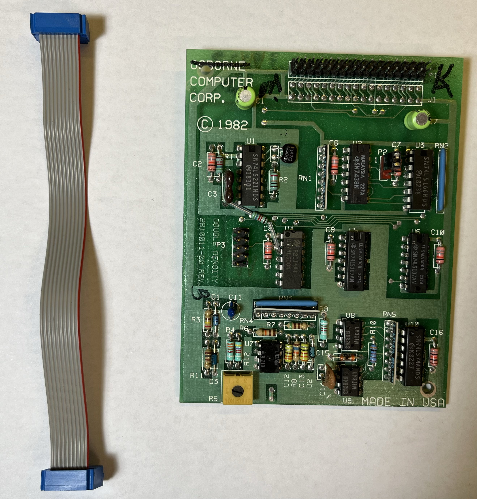
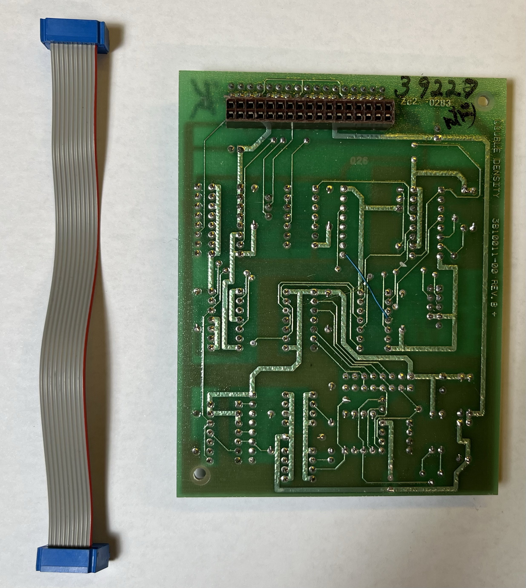
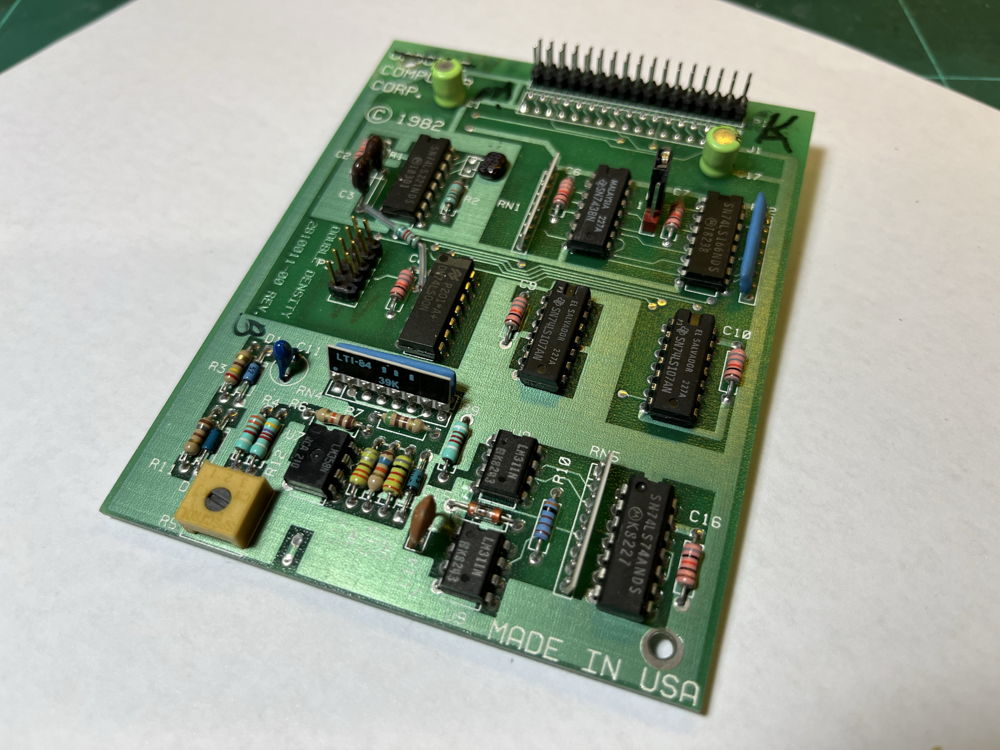
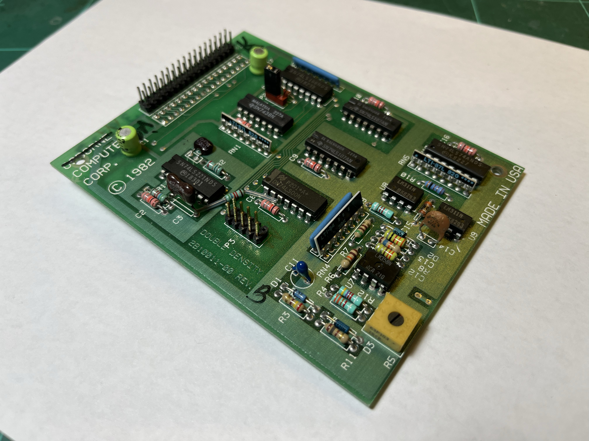
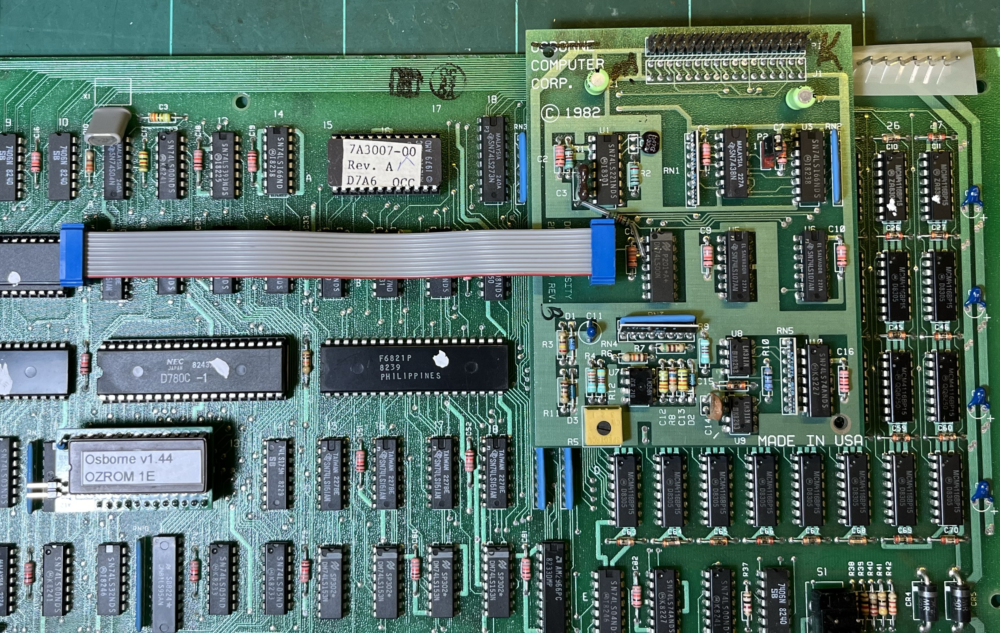
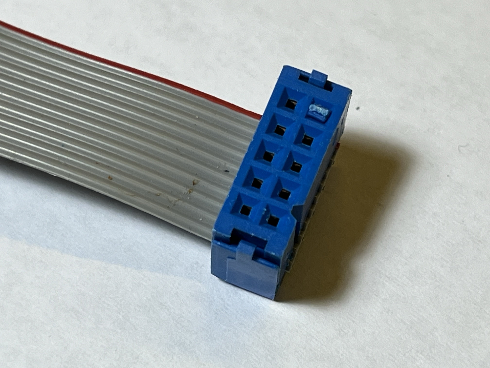

# Osborne Model 1 Double Density Upgrade
## Modern Reproduction
[Nathaniel Roach's reproduction DD board](https://gitlab.com/NRoach44/occ1-dd-upgrade)
[VCFED Forum post](https://forum.vcfed.org/index.php?threads/reproduction-osborne-1-dd-upgrade-card.1239167/)

## Images of Osborne board

